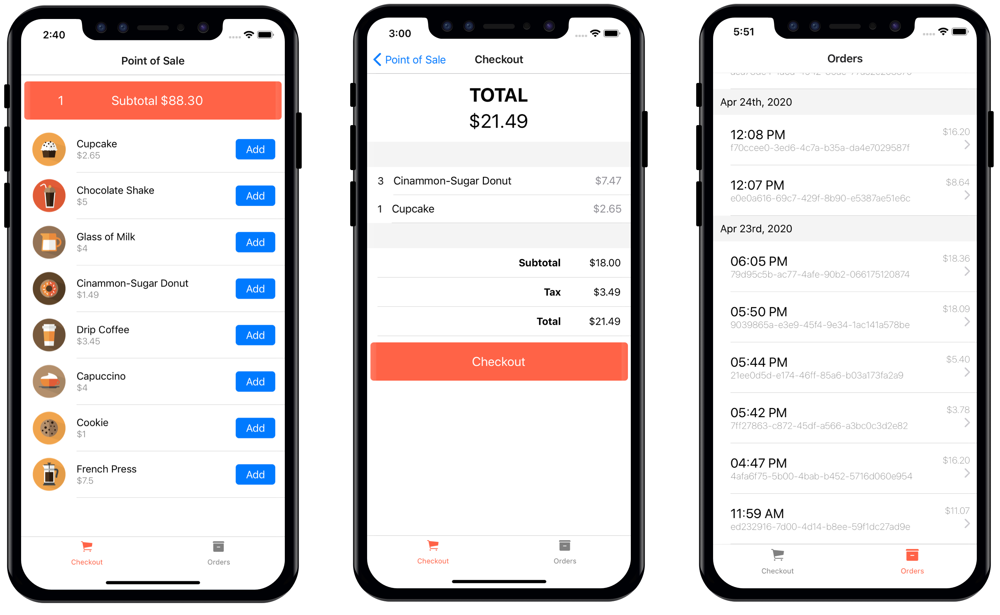
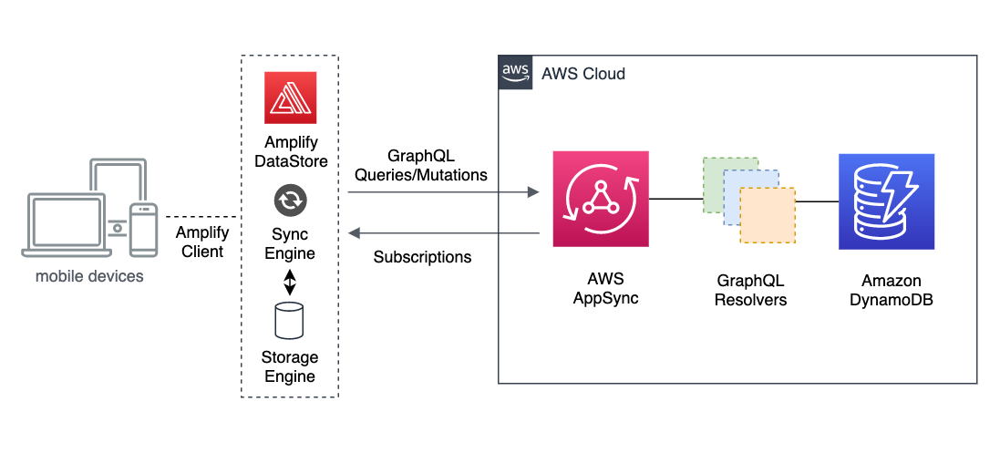

# AppSync Offline Reference Architecture

This repository contains the code for a mobile app written in React Native that uses Amplify DataStore and AWS AppSync to provide offline and delta sync capabilities. Use this repository as an example to build your own application. 

Read the Blog Post about this project for more information: [AWS AppSync offline reference architecture – powered by the Amplify DataStore](https://aws.amazon.com/blogs/mobile/aws-appsync-offline-reference-architecture).

## Point of Sale

The theme of this mobile application is a Point of Sale (POS) for a Coffee Shop. What better use case for offline capabilities than a POS app that handles sales and transactions. These type of applications are critical for a business and is important that they handle internet outages and data synchronization gracefully while continue to process transactions.  



## Architecture Overview

The code in this repository contains both the backend definition and the frontend mobile app. The backend is powered by a GraphQL API running on AWS AppSync with a set of managed resolvers that manipulate and query the data on DynamoDB tables. The frontend is a React Native application that uses Ampify DataStore to interact with the backend and handle the data synchronization with delta sync, local storage and conflict resolution. 



Amplify DataStore communicates with AWS AppSync using GraphQL queries, mutations and subscriptions, however this communication is abstracted away from the developer as you only need to interact with the DataStore API using standard JavaScript function invocations. 

### GraphQL Schema

The GraphQL schema definition is an important part of this project because is what Amplify uses to create the backend with the DynamoDB tables and AppSync resolvers. And also what you use to interact with Amplify DataStore on the device.

```graphql
type Order @model {
  id: ID!
  total: Float
  subtotal: Float
  tax: Float
  createdAt: String!
  lineItems: [LineItem] @connection(name: "OrderLineItems")
}

type LineItem @model {
  id: ID!
  qty: Int
  order: Order @connection(name: "OrderLineItems")
  product: Product @connection
  description: String
  price: Float
  total: Float
}

type Product @model {
  id: ID
  sku: String
  name: String
  price: Float
  image: String
}
```


## How to run it

If you want to run this project yourself, you need the following pre-reqs in your computer: 

* [Node.js](https://nodejs.org/en/)
* [Git](https://git-scm.com/)
* [Expo CLI](https://docs.expo.io/get-started/installation)
* [iOS](https://docs.expo.io/workflow/ios-simulator) or [Android](https://docs.expo.io/workflow/android-studio-emulator) simulator
* [Amplify CLI](https://github.com/aws-amplify/amplify-cli#install-the-cli)

If you have them, then go ahead and clone the repository: 

```
git clone https://github.com/aws-samples/aws-appsync-refarch-offline
cd aws-appsync-refarch-offline
```

Install the dependencies using yarn:

```
yarn install
```

Or using npm:

```
npm install
```

And now follow the next instructions to run both the Backend and Frontend.

### Backend

Provisioning the backend is very simple with the Amplify CLI. Just run the following commands and make sure you have access to an AWS account:

```
amplify init
```

And then deploy to an AWS account:

```
amplify push
```

Wait for deployment to finish and then you can launch the frontend:

### Frontend

Make sure you have the iOS or Android simulator running and then start the application with the following command:
```
yarn start 
```

or using npm:
```
npm start
```
